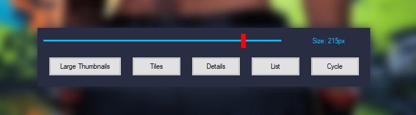

🔥🔥 Dynamic Thumbnails Slider with Cycle View Mode 🔥🔥

🌿⚡ This AutoHotkey-based utility offers a sleek, real-time GUI overlay for controlling Windows Explorer view modes and thumbnail sizes. Designed for power users and customization enthusiasts, it includes three modular scripts—each with compiled .exe and editable .ahk versions—for flexible deployment and integration.

🌹🔧 Features Overview 🌹

- Dynamic Thumbnail Resizing  
  A horizontal slider lets you adjust thumbnail size from 16px to 256px in real time. The slider is:
  - Visually enhanced with a bright blue 3x-thick slider line
  - Topped with a bright red thumb indicator for precise control
  - Accompanied by a live size display (e.g., Size: 215px) that updates instantly

- Explorer View Mode Controls  
  Five intuitive buttons allow you to switch between:
  - Large Thumbnails
  - Tiles
  - Details
  - List
  - Cycle (automatically rotates through modes)

- Global Hotkeys
  - Ctrl+W: Cycles view mode even when GUI is hidden
  - Ctrl+F12: Toggles GUI visibility on/off

- Explorer Integration  
  Uses COM automation to apply view changes directly to active Explorer windows. If COM fails, fallback keystrokes (Ctrl+Shift+2, etc.) ensure reliability.

- Notification System  
  Lightweight toast-style popups confirm actions like mode changes or thumbnail size updates.

---

📦 Included Scripts

| Script Name | Description |
|------------|-------------|
| Dynamic.Thumbnails.Slider.With.Cycle.View.Mode.ahk | GUI overlay without title bar for a minimalist look. Ideal for embedding or floating overlays. |
| Dynamic.Thumbnails.Slider.With.Cycle.View.Mode(With.Title.bar).ahk | GUI overlay with title bar for easier dragging and window management. |
| Easy.Windows.Drag.KDE.Style.ahk | KDE-style drag behavior using Alt+Mouse gestures. Lets you move or resize any window, including the slider GUI without a title bar. |

---

👉 🌹 Slider Without Title Bar 🌹

 

---

👉 🌿 Slider With Title Bar 🌿

 

---

🖥️ Compatibility & Deployment

- ✅ Tested on Windows 10
- ✅ Confirmed working on Windows 11
- 🛠️ Available as both .ahk source and .exe binaries for each tool
- 🧩 Designed for modular use—combine or run standalone

---

💡 Use Cases

- Quickly toggle between Explorer views while browsing folders
- Resize thumbnails dynamically for visual clarity or compactness
- Integrate into custom desktop workflows or automation suites
- Use KDE-style drag to reposition GUI overlays without relying on title bars

---
