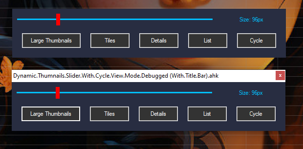
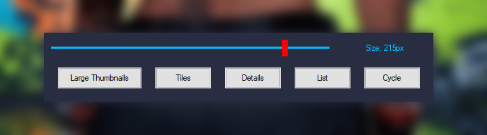
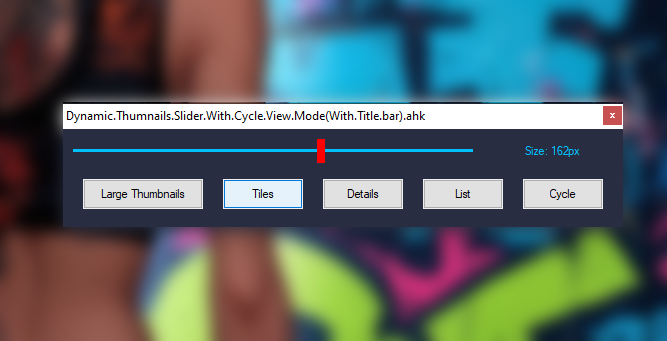

🔥🔥 Dynamic Thumbnails Slider with Cycle View Mode 🔥🔥

---

🎯 New Debugged Version is Out 🎯

---

# 🐛 Debug Version Explanation

## Why Use the Debug Version?
The debug version includes comprehensive logging and troubleshooting features that help identify and resolve issues with Windows Explorer integration. This version is highly recommended if you're experiencing any problems with the script.

---

## 🔧 COM Bug Fix (Previous Version Issue)

### The Problem
In the previous version, buttons weren't working while the slider continued to function normally. This was caused by a COM (Component Object Model) interface bug when communicating with Windows Explorer.

**Symptoms:**
- ✅ Slider works fine  
- ❌ View mode buttons don't respond  
- ❌ Cycle button has no effect  
- 🔄 May not affect all Windows versions (varies by build and configuration)

### The Fix
The debug version implements:
- Multiple fallback methods to interact with Explorer windows  
- Active window detection to ensure the correct Explorer instance is targeted  
- Enhanced error handling with detailed logging  
- Keyboard shortcut fallback when COM methods fail  

---

## 📦 Two Versions Available

### 🖼️ With Title Bar
- Standard Windows title bar for easy window dragging  
- Traditional window appearance  
- More visible and easier to reposition  

### 🎯 Without Title Bar (Borderless)
- Minimal, modern interface  
- Cleaner aesthetic  
- Drag anywhere on the window to move it (uses PostMessage for drag functionality)  
- Takes up less screen space  

> Choose based on your preference! Both versions have identical functionality.

---

## 🎨 Dark Mode Buttons
The new version features dark-themed buttons using Windows' native dark mode styling:

 
---

## 📜 This provides:
---
- 🌙 Consistent dark UI appearance
- 👁️ Better visual comfort
- 🎯 Modern, professional look
- 🔄 Native Windows theming
- 🐞 Debug Mode Features

---

## ⭐ Default State

Debug mode is disabled by default to avoid cluttering your workflow with technical messages.

---

## 🌱 Toggle Debug Mode
Press Ctrl+D to enable/disable debug logging on-the-fly.

---

## 📣 What Debug Mode Shows:
- 📝 Detailed operation logs via OutputDebug
- 💬 Real-time tooltips showing current actions
- 🔍 COM window detection status
- ⚠️ Error messages with specific failure reasons
- ✅ Success confirmations

---

📌 Why It's Useful ?

-Troubleshoot why buttons might not work on your system
-Verify which Explorer window is being targeted
-Identify if COM methods or keyboard fallbacks are being used
-Report issues with detailed logs for support

---

## 🎮 Hotkeys Reference

##⌨️Hotkey Function

- Ctrl+F12 : Toggle GUI visibility
- Ctrl+W : Cycle through view modes
- Ctrl+D : Toggle debug mode

---

💡 Recommendation

Start with debug mode OFF for normal use. If you encounter any issues with the buttons or view mode switching, press Ctrl+D to enable debugging and observe what's happening. This helps diagnose system-specific compatibility issues! 

---

## Old Description 
## This provides

🌿⚡ This AutoHotkey-based utility offers a sleek, real-time GUI overlay for controlling Windows Explorer view modes and thumbnail sizes. Designed for power users and customization enthusiasts, it includes three modular scripts—each with compiled .exe and editable .ahk versions—for flexible deployment and integration.

🌹🔧 Features Overview 🌹

- Dynamic Thumbnail Resizing  
  A horizontal slider lets you adjust thumbnail size from 16px to 256px in real time. The slider is:
  - Visually enhanced with a bright blue 3x-thick slider line
  - Topped with a bright red thumb indicator for precise control
  - Accompanied by a live size display (e.g., Size: 215px) that updates instantly

- Explorer View Mode Controls  
  Five intuitive buttons allow you to switch between:
  - Large Thumbnailsrge Thumbnails
  - Tiles
  - Details
  - List
  - Cycle (automatically rotates through modes)

- Global Hotkeys
  - Ctrl+W: Cycles view mode even when GUI is hidden
  - Ctrl+F12: Toggles GUI visibility on/off

- Explorer Integration  
  Uses COM automation to apply view changes directly to active Explorer windows. If COM fails, fallback keystrokes (Ctrl+Shift+2, etc.) ensure reliability.

- Notification System  
  Lightweight toast-style popups confirm actions like mode changes or thumbnail size updates.

---

📦 Included Scripts

| Script Name | Description |
|------------|-------------|
| Dynamic.Thumbnails.Slider.With.Cycle.View.Mode.ahk | GUI overlay without title bar for a minimalist look. Ideal for embedding or floating overlays. |
| Dynamic.Thumbnails.Slider.With.Cycle.View.Mode(With.Title.bar).ahk | GUI overlay with title bar for easier dragging and window
| Easy.Windows.Drag.KDE.Style.ahk | KDE-style drag behavior using Alt+Mouse gestures. Lets you move or resize any window, ,this tool gives you the ability to move the slider GUI without a title bar. |

---

👉 🌹 Slider Without Title Bar 🌹

 

---

👉 🌿 Slider With Title Bar 🌿

 

---

🖥️ Compatibility & Deployment
 - ✅ Tested on Windows 10

✅ Confirmed working on Windows 11
- 🛠️ Available as both .ahk source and .exe binaries for each tool
- 🧩 Designed for modular use—combine or run standalone

---

💡 Use Cases

- Quickly toggle between Explorer views while browsing folders
- Resize thumbnails dynamically for visual clarity or compactness
- Integrate into custom desktop workflows or automation suites
- Use KDE-style drag to reposition GUI overlays without relying on title bars (Standalone script)

---

🧐 Demo Slider With Title Bar 🧐

---

🌿🌹 Enjoy My Personal Slider Tool 🌹🌿
